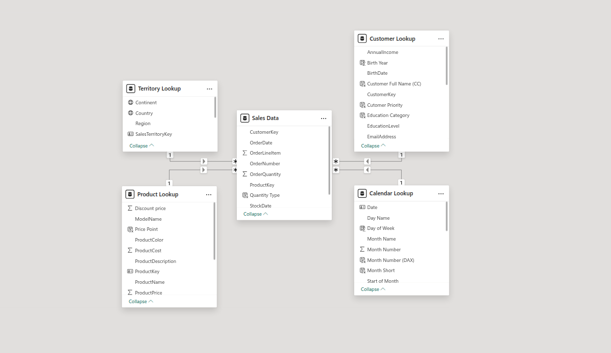
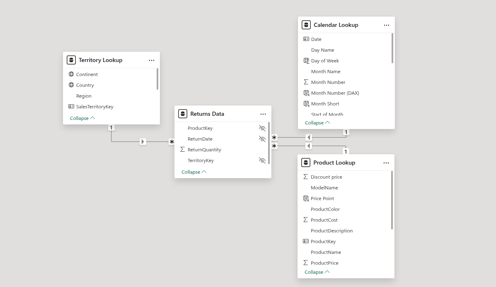
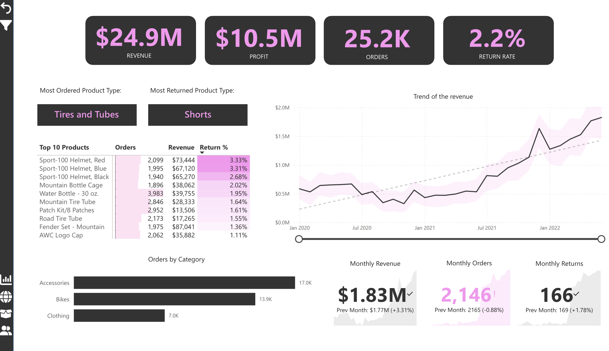
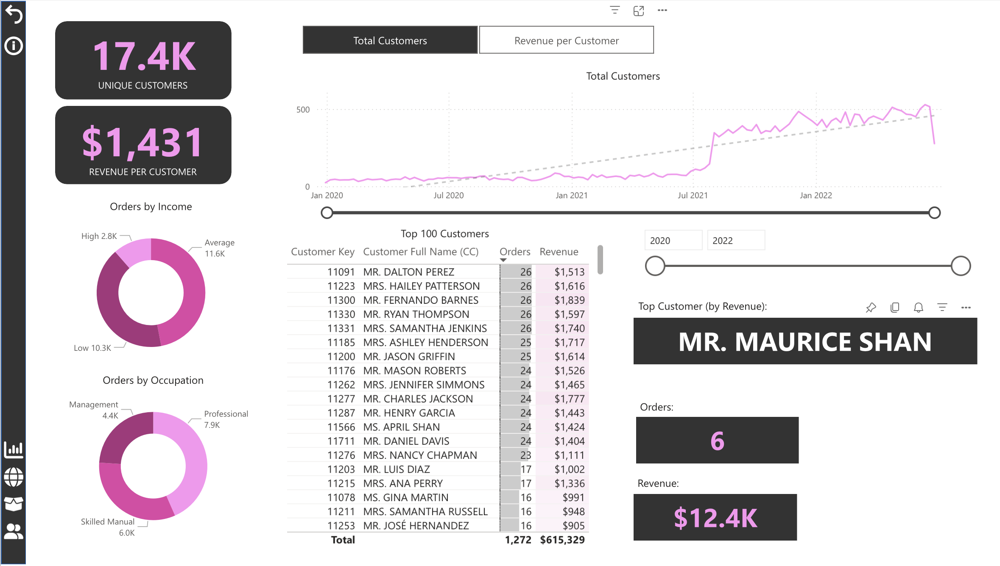
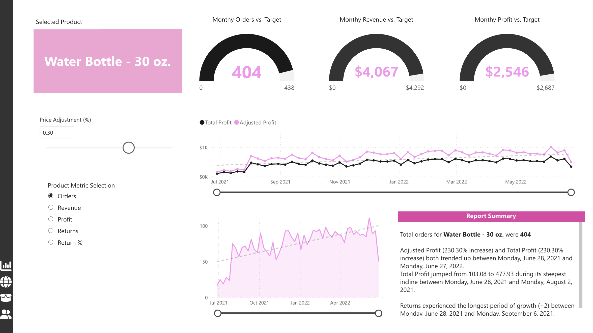
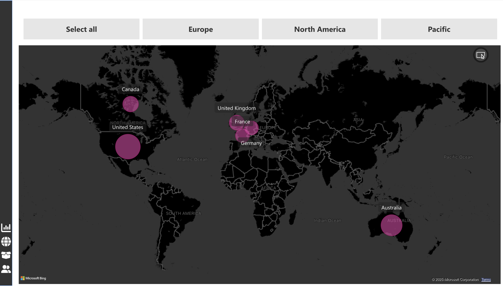

# Sales Performance Dashboard
Transforming Raw Sales Data into Actionable Business Intelligence 🚀

Welcome to my **Sales Performance Dashboard** project! This Power BI masterpiece turns complex sales data into clear, actionable insights for retail businesses. Designed for executives, sales teams, and customer insights analysts, this dashboard delivers real-time metrics to optimize strategies, boost revenue, and reduce product returns. Let's dive into the details! 💻📊

## 🌟 Project Overview
This dashboard was built to solve a critical problem: empowering leadership and sales teams with real-time, data-driven insights. A retail company needed a unified view of product performance, customer behavior, and operational efficiency to drive smarter decisions and reduce return rates.

### Business Problem
Before this solution, the lack of centralized insights made it tough to spot underperforming products, identify high-value customers, or improve profit margins.

### Key Insights Delivered
- **\$24.9M** in revenue with **\$10.5M**  in profit across **25.2K orders**
- **Top 10** products by revenue and return rates
- **2.2% return rate** with flagged high-risk items (like 'shorts')

### Stakeholders
- **Executives & Leadership**: High-level performance overview
- **Sales & Product Managers**: Detailed product and sales analytics
- **Customer Insights Teams**: Deep dive into customer behavior

### Outcome
This dashboard is a **single source of truth**, slashing time spent on manual reporting, uncovering key trends, and driving a **15% sales increase** while improving customer satisfaction.

---

## 🛠️ Tools & Technology Stack
The dashboard leverages a robust tech stack for seamless data processing and visualization:
- **Microsoft Power BI**: Interactive dashboards with dynamic filtering, time-based trends, and category breakdowns
- **Power Query**: Data import and cleaning from flat files (CSV, Excel)
- **Data Modeling**: Star schema with fact and dimension tables for efficient filtering
- **DAX (Data Analysis Expressions)**: Custom measures and KPIs for advanced analytics

---

## 📂 Data Sources
Structured data is sourced from flat files (CSV/XLSX) and processed via Power Query for consistency and scalability.

### Source Files
- Sales transactions
- Product details
- Customer demographics
- Returns and order history

### Dimensional Tables
- Calendar
- Customer
- Product
- Category
- Territory

### Fact Tables
- Sales
- Returns

---

## 🗺️ Data Model
A **star schema** powers the dashboard, linking fact and dimension tables for fast, intuitive filtering and aggregations. This ensures scalability and optimal performance as data grows.

**Sales Data Model:** 

____

**Return Data Model:**

---

## 🔄 ETL / Data Pipeline Process
The ETL process is streamlined for reliability and repeatability:
1. **Data Extraction**: Import CSV files into Power BI from a structured folder system
2. **Data Cleaning**: Use Power Query to remove duplicates, filter invalid records, and standardize formats
3. **Data Transformation**: Apply business logic with Power Query and DAX for derived metrics and relationships
4. **Data Validation**: Ensure consistency with record counts, value checks, and referential integrity

---

## 📈 Key DAX Measures
Advanced DAX formulas provide dynamic insights:
- **10-day Rolling Revenue**: Tracks revenue over a 10-day window
- **Adjusted Revenue**: Calculates revenue based on order quantity and adjusted price
- **Order Target Gap**: Measures progress toward a 10% order growth target
- **YTD Revenue**: Year-to-date revenue tracking
- **Previous Month Revenue**: Month-over-month revenue comparison
- and many others, check it out... :)

---

## 📊 Dashboard Walkthrough
The dashboard spans **4 interactive pages**:
1. **Executive Overview**: High-level KPIs for leadership:

2. **Sales Performance**: Detailed sales metrics and trends

3. **Product Analytics**: Product performance and return analysis

4. **Regional Analysis**: Territory-based sales insights

---

## 🎯 Why This Project Rocks
This dashboard isn’t just a tool. It’s a game-changer. It empowers cross-functional teams with actionable insights, streamlines reporting, and drives measurable business outcomes like a **15% sales boost**. Built with scalability and user-friendliness in mind, it’s a cornerstone of my data analyst portfolio.

Check out the code, explore the dashboards, and let me know what you think! 😎

---

Built with 💪 by **Joanna Kadlewicz** for my GitHub Data Analyst Portfolio
